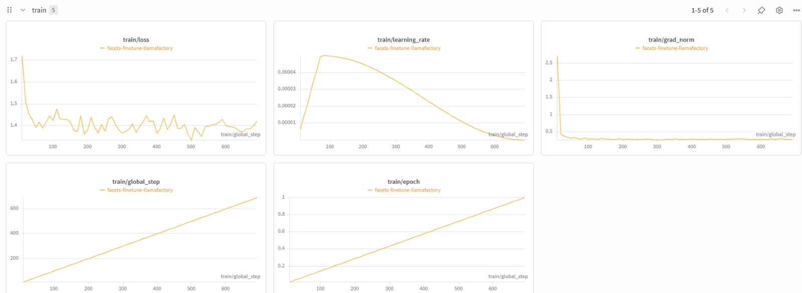
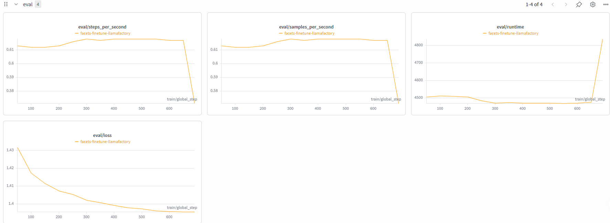
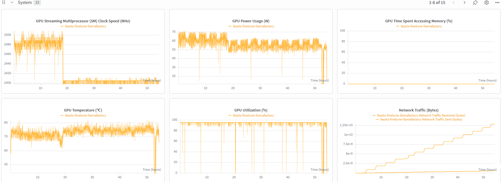

# Qwen2.5 Fine-Tuning for Scientific Faceted Summarization

## Overview

This project fine-tunes the Qwen2.5 language model to generate **facet-based summaries** for scientific papers.

Instead of producing a single generic summary, the model generates structured summaries consisting of four facets:

- Purpose
- Method
- Findings
- Value

The model was fine-tuned using the **FacetSum** dataset through the **LLaMA-Factory** framework with LoRA fine-tuning.

----

## Model

- Base Model: **Qwen2.5-1.5B-Instruct**
- Fine-tuning Method: **LoRA**
- Framework: **LLaMA-Factory**

----

# Training Infrastructure

The fine-tuning experiments were conducted on the following hardware **NVIDIA DGX Spark**:

| Component | Specification   |
|-----------|-----------------|
| CPU       | 10 Cores        |
| GPU       | NVIDIA Blackwell Architecture    |
| Unified Memory   | 128 GB          |     
| Storage   | 4 TB            |

This high-performance environment enabled efficient fine-tuning on long-context scientific documents.

----

# Environment Setup

### 1. Create a virtual environment

```bash
python3 -m venv env-name
source ~/env-name/bin/activate
```

### 2. Clone LLaMA-Factory

```bash
git clone https://github.com/hiyouga/LLaMA-Factory.git
cd LLaMA-Factory
```

---

### 3. Install dependencies

```bash
pip install --upgrade pip
pip install -e .[metrics]
pip install wandb
```

---

# Dataset Preparation

Copy your training and validation JSON files into:

```
LLaMA-Factory/data/
```

Then edit:

```
LLaMA-Factory/data/dataset_info.json
```

and append:

```json
"facets_finetune_train": {
    "file_name": "your_training_file.json",
    "columns": {
            "prompt": "instruction",
            "query": "input",
            "response": "output",
            "system": "system",
            "history": "history"
        }
},
"facets_finetune_val": {
    "file_name": "your_validation_file.json",
    "columns": {
            "prompt": "instruction",
            "query": "input",
            "response": "output",
            "system": "system",
            "history": "history"
        }
}
```

---

# Start a Screen Session

```bash
screen -S your-screen-name
```

---

# Activate the Environment

```bash
source ~/env-name/bin/activate
cd ~/LLaMA-Factory
```

---

# Login

```bash
huggingface-cli login
wandb login
```

---

# Training

```bash
WANDB_PROJECT="Mirath" llamafactory-cli train ~/LLaMA-Factory/examples/train_lora/facets_train.yaml
```

---

# Monitoring Training

Training was monitored using **Weights & Biases (W&B)**.

The following metrics were tracked throughout training:

- Training Loss
- Validation Loss
- Learning Rate
- Gradient Norm
- Epoch Progress


## Training Curves



## Validation Curves



## System Curves




